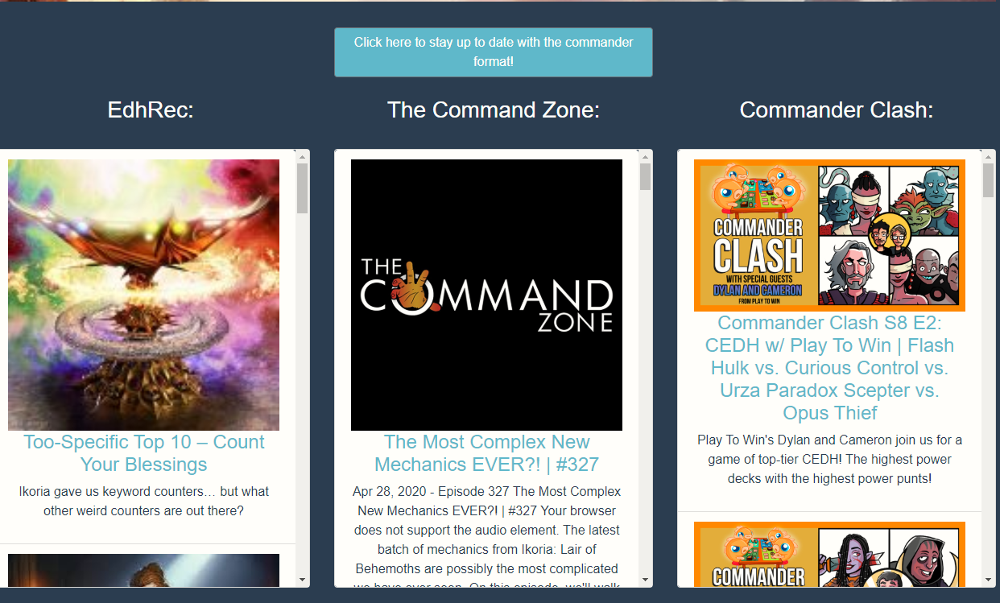

# command-central

Welcome to Command Central! this is you7r ideal site for all aspects of the commander format.  

## Overview

Command Central is an information focused app that can be used by commander players for Magic: The Gathering. This app offers multiple resources needed by commander players. Players have access to news articles from some of the most popular sources. The current meta-game is also available to players so they can stay informed on what might be across the table. Players using Command Central can also use the card database to help them construct decks. The final tool offered to players is the resource section. Players can see the rules, banned card list and more aspects of the format using this page.  

## Features and Instructions

### Homepage
When the user navigates to his page they will be able to get the most recent articles from EDHRec, The Command Zone and Tolarian Community College. 

1. To access the articles start by navigating to the homepage.  

*  Navbar tab to go to Homepage  

* Image of Homepage  
  

2. Click the button in the center of the page.

* Article Button  
  

3. After the button is clicked articles from all three sources will render on the page.  The user can also click on any article image or title to navigate to the full article on a new tab.

* Page with articles  
 

### Meta-game
When the user navigates to this page they will be able to access both the main meta-game and the budget meta-game. The user can also navigate to a page with a sample deck-list. 

1. To access the meta-game start by navigating to the meta-game page.  

*  Navbar tab to go to Meta-game  

* Image of Meta-game  
  

2. Click the button in the center of the page.

* Meta-game Button  
  

3. After the button is clicked both the main and budget meta-game will render onto the page.  The user can also click on any deck title to navigate to an example deck-list on a new tab.

* Page with Meta-game  
 

### Database 
When the user accesses the database they will be able to search for cards they are looking for by name or whats in the card text. The database will give the user teh card-name, mana-cost, card-type, set, rarity, card-text, commander legality, and both the standard and foil price in US dollars.

1. To access the database start by navigating to the database page.  

*  Navbar tab to go to Database  

* Image of Database  
  

2. The user can search for cards by card-name or what is in the cards text. THe user starts by filling out the search field. 

* Search Field  
  

3. Once the search field is filled out the user can search by card-name by clicking the "Search by Name" or search by whats in the card text by clicking the "Search with Text" button.

* Card-name Button  
 

* Results from card-name search  
  

* Text Button  
 

* Results from text search  
  

### Resources
When the user accesses the resources page they will be able to view different information related to the commander format.  This information includes the philosophy of the commander format, the deck construction rules and the play rules. The user also has access to to the different types of cards that are not legal in commander.

1. To access the resources start by navigating to the resource page.  

*  Navbar tab to go to Resources  

* Image of Resources  
  

### Login
This app also has a login feature for users to aid future development.

1. To access the login start by navigating to the login page.  

*  Navbar tab to go to Login  

* Image of Login  
 

2. Navigate to the sign-up page with the following button. Fill out all fields then click "Sign up" 

*  Sign-up Page Button  

* Image of Sign-up Page  
  

* Sign-up Button  
 

3.  Once the user signs up they will be redirected to the homepage with their name on the right sided of the nav-bar. They can logout by simply clicking the logout tab in the nav-bar. 

*  Signed in Page  

* Logout  
  

4. The user can log in by navigated to the login page and filling out the fields and clicking the login button if they have already signed up.

*  Navbar tab to go to Login  

* Image of Login  
 

* Login Button  
 

## Links

### Deployed App Page
 
https://command-central.herokuapp.com/

### Git-Hub Page

https://github.com/EricVincitore/command-central

## Technologies Used

* HTML
* React
* Reactstrap
* Javascript
* Node
* Passport
* BCrypt
* Express
* Mongoose
* Node
* Heroku
* Scryfall API

## Development Role

This app was developed by Eric Vincitore.